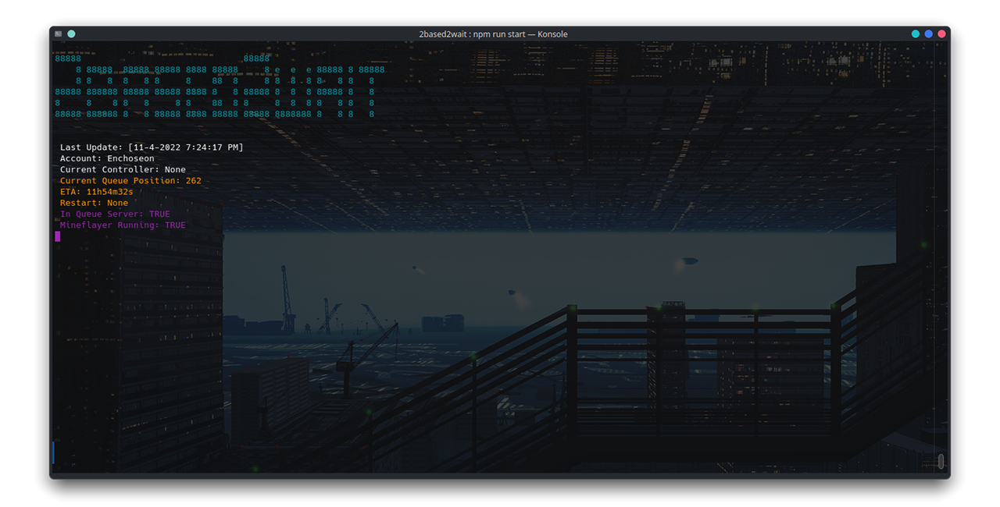
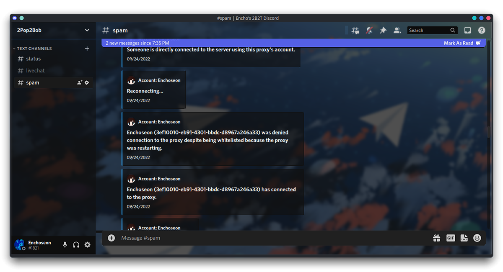
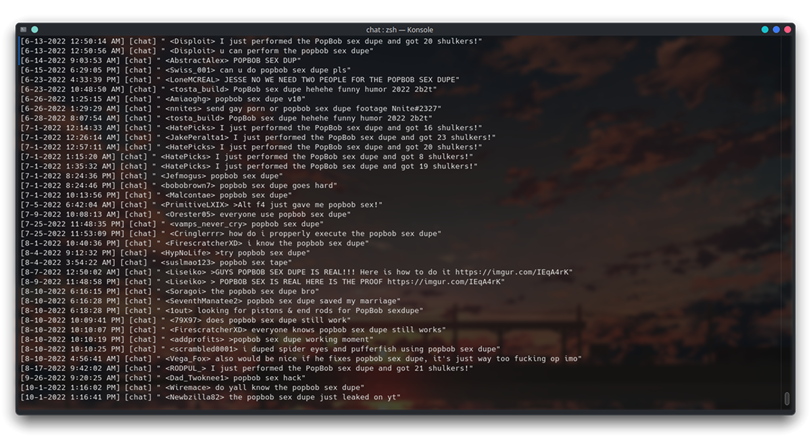

	<h1>2Based2Wait</h1>
	
Lightweight & (theoretically) extensible 2b2t proxy.

	<h4>
		<a href="https://github.com/Enchoseon/2based2wait/wiki">Wiki</a>
		 · 
		<a href="https://github.com/Enchoseon/2based2wait/issues">Report Bug</a>
	</h4>
	
	
	
	

 

# Table of Contents

- [Quick Start](#quick-start)
- [Features](#features)
- [Images](#images)
- [Keep in Mind](#keep-in-mind)
- [For Developers](#for-developers)

# Quick Start

1. In `config.json`, configure the following values:
    - `account.username`: Your Minecraft account playername.
    - `proxy.whitelist`: Playernames of accounts that are allowed to connect to the proxy.
2. Run `npm ci`
3. Run `npm start`
4. Enter the auth code that appears in the console into microsoft.com/link
5. Connect to `127.0.0.1` in Minecraft
    - If `127.0.0.1` doesn't work try `0.0.0.0`

*(See [configuration guide](https://github.com/Enchoseon/2based2wait/wiki/Configuration-Guide) to see how to enable features like Ngrok tunneling or Discord webhooks.)*

# Features

- Extremely low RAM and CPU usage
- Robust auto-reconnection
  - Battle-tested to be online 24/7/365
- High configurability
  - Easily configure small-to-medium-sized networks
- Convenient Discord webhooks for:
  - Livechat
  - Queue position
  - Tunnels & connections
- Toast notifications
- Auto `/queue main`
- Mineflayer support and extensibility *(see: `./utils/mineflayer.js`)*
  - Already comes with:
    - Kill aura
    - Auto eat
    - Anti afk
    - Anti drowning
- Extensive logging
- Share proxies with plug-and-play Ngrok tunnels
  - Your machine's IP is never shared with players connecting to your proxy
  - Your players' IPs are never shared with your machine

# Images

   <em>No-Frills Cli Gui</em> 
   <em>Convenient Discord Webhooks</em> 
   <em>Extensive Logs</em> 

# For Developers

If you have a local copy of 2based2wait with a personal config.json that's being tracked by git despite the .gitignore rule, run the following command:

`git update-index --assume-unchanged config.json`

# Keep in Mind

2based2wait ships with as many options __disabled by default__ as possible; including [auto-reconnect](https://github.com/Enchoseon/2based2wait/wiki/How-to-Auto-Reconnect-with-Supervisor), [ngrok tunneling](https://github.com/Enchoseon/2based2wait/wiki/How-to-Share-Accounts-With-A-Reverse-Proxy) (for sharing accounts), [coordination](https://github.com/Enchoseon/2based2wait/wiki/How-to-Proxy-Multiple-Accounts) (for multiple proxies), Discord webhooks, and much more.

  
  
<strong>If you want to utilize all the proxy's features you'll need to <a href="https://en.wikipedia.org/wiki/RTFM">RTFM</a>, <em>especially</em> the <a href="https://github.com/Enchoseon/2based2wait/blob/main/docs/configuration-guide.md">configuration guide</a>.</strong>

